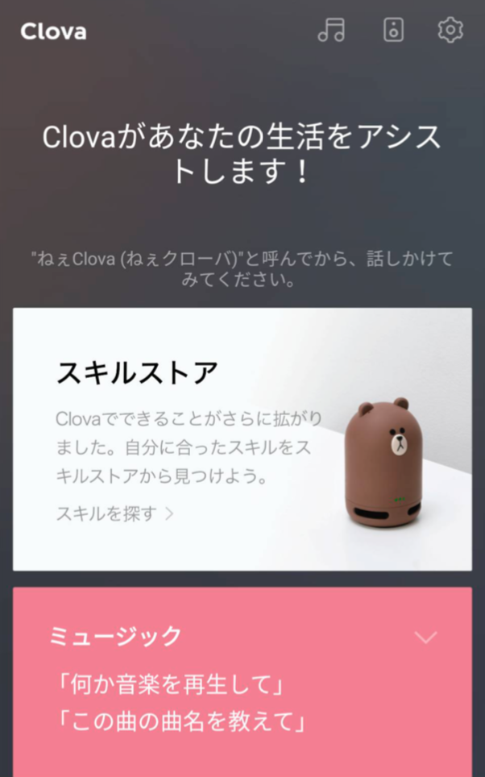

# このドキュメントについて
このドキュメントはClovaスキルを`Node.js`で実装するための非公式なチュートリアルです。
このドキュメントの通りに実装すれば、簡単なClovaスキルを動かすこと、スキルへの対話を元にLINEメッセージを送信することができます。

## 必要なもの
- LINE ID(スマホでLINEを登録し、メールアドレスの登録まで完了させてください)
- Clovaデバイス
- インターネットに接続され、CLIで操作できるコンピュータ

## 利用するもの(詳細は後述)
- Clova-CEK-SDK-Nodejs
- ngrok

# はじめに
### Clovaスキルとは
Clovaにはデバイス購入時にそのまま利用することができるビルトインのスキルと、スキルストアに掲載されているスキルの2種類があります。
スキルストアは、Clovaアプリを起動し、ホーム画面にある導線をタップすると開くことができます。


Clovaスキルは、スキルストア詳細画面にて確認できる`呼び出し名`を利用して起動することができます。
- `呼び出し名`を起動して
- `呼び出し名`を開いて
- `呼び出し名`をつないで
スキルの起動をせずにスキルを利用開始することはできません。
また、一度起動したスキルはスキルサーバーから明示的に終了するリクエストを送った場合(link: shouldEndSession)か、ユーザが`終了して`などスキルを終了する発話をするまでは、起動したスキルが応答をする状態になります。
`ねぇClova、XXを起動して`という発話から、スキルが終了するまでを1セッションと扱います。

そのため、特定のスキルを起動中に`今日の天気は？`とユーザが発言したとしても、通常のClovaのお天気機能が呼び出されることはありませんし、1度スキルが終了してしまったら再度スキルの起動を促す発話をユーザがするまで、スキルは起動状態にすることができません。

```やってみよう
ねぇClova、激むず早口言葉を起動して！と話しかけて実際のスキルの挙動を確認してみよう
```

### Clovaが提供してくれること、スキルが実装すること


### スキルの公開までのフロー
スキルを公開するには以下の手順を踏む必要があります。
* [チャネルを作成する](https://clova-developers.line.me/guide/#/DevConsole/Guides/CEK/Create_Channel.md)
* [Extensionを登録する](https://clova-developers.line.me/guide/#/DevConsole/Guides/CEK/Register_Extension.md)
* [対話モデルを登録する](https://clova-developers.line.me/guide/#/DevConsole/Guides/CEK/Register_Interaction_Model.md)
* [対話モデルをテストする](https://clova-developers.line.me/guide/#/DevConsole/Guides/CEK/Test_Extension.md)
* [Clovaデバイスでテストする](https://clova-developers.line.me/guide/#/DevConsole/Guides/CEK/Device_Test_Extension.md)
* [Extensionを配布する](https://clova-developers.line.me/guide/#/DevConsole/Guides/CEK/Deploy_Extension.md)

[Extensionを配布する](https://clova-developers.line.me/guide/#/DevConsole/Guides/CEK/Deploy_Extension.md)の中で、[審査をリクエストする](https://clova-developers.line.me/guide/#/DevConsole/Guides/CEK/Deploy_Extension.md#RequestExtensionSubmission)という項目で説明されている通り、スキルを公開する前には審査が必要になります。

# 下準備
### LINE DevelopersとClova Developer Centerβ
Clovaのスキルを作成するには2つのDeveloper Centerを操作する必要があります。
* [LINE Developers](https://developers.line.me/ja/)
* [Clova Developer Centerβ](https://clova-developers.line.me/)

### チャネルを作成する
こちらのドキュメントを参考にまずはチャネルを作成しましょう。
[チャネルを作成する](https://clova-developers.line.me/guide/#/DevConsole/Guides/CEK/Create_Channel.md)

#### プロバイダーとは？
> チャネルにアプリを提供する個人または組織。チャネルを作成するには、LINE Developersコンソールでプロバイダーを作成する必要があります。例えば、個人や企業の名前をプロバイダーとして使用できます。

引用元: [用語集](https://developers.line.me/ja/docs/glossary/)

スキルを実装するには、プロバイダーとチャネルの両方を作る必要があります。
※ スキルとLINEを連携して利用するには同一のプロバイダーにBotのチャネルとスキルのチャネルを作る必要があります

# スキルを作り始める
## ゴールとシナリオを決定する
これから実装するスキルが提供するシナリオのゴールを決定しましょう。
[目標を設定する](https://clova-developers.line.me/guide/#/Design/Design_Guideline_For_Extension.md#SettingGoal)

## 対話モデルを構築する
対話モデルを構築して、これから実装するスキルサーバーへのRequestを確定させましょう

* 対話モデルとは？->[対話モデルを定義する](https://clova-developers.line.me/guide/#/Design/Design_Guideline_For_Extension.md#DefineInteractionModel)
* 実際の操作->[対話モデルを登録する](https://clova-developers.line.me/guide/#/DevConsole/Guides/CEK/Register_Interaction_Model.md)

### 作成するもの
Built-in Slot: CLOVA.JP_ADDRESS_KEN
Custom Intent: AnswerPrefecture
[このtsvをダウンロードしてアップロード](./document/tsv/com.ozyozyo.handson.test_intent_AnswerPrefecture.tsv)

## スキルサーバーを実装する
```
$ npm init -y
$ npm i @line/clova-cek-sdk-nodejs express body-parser
```

`skill.js`というファイルを作成し、以下のコードを貼り付けてください。
```
// 必要な設定を読み込む
const clova = require('@line/clova-cek-sdk-nodejs');
const express = require('express');

// TODO: あなたのEXTENSION_IDに置き換えてください
const EXTENSION_ID = 'your extension id';


// `IntentRequest`が呼び出されたときに実行されます
const intentHandler = async responseHelper => {
  const intentName = responseHelper.getIntentName();
  const sessionId = responseHelper.getSessionId();

  // Intentの名前をログに出力します
  console.log('intentName: ' + intentName);

  switch (intentName) {
    case 'Clova.YesIntent':
      // ユーザーが`はい`と発話したときは`はいはい`と返事します
      responseHelper.setSimpleSpeech(
        clova.SpeechBuilder.createSpeechText('はいはい')
      );
      break;
    case 'Clova.NoIntent':
      // ユーザーが`いいえ`と発話したときは`いえいえ`と返事します
      responseHelper.setSimpleSpeech(
        clova.SpeechBuilder.createSpeechText('いえいえ')
      );
      break;
    default:
      // ユーザーがそれ以外の発話をしたときは`なんなん`と返事します
      responseHelper.setSimpleSpeech(
        clova.SpeechBuilder.createSpeechText('なんなん')
      );
      break;
  }
};

const clovaHandler = clova.Client
  .configureSkill()
  .onLaunchRequest(responseHelper => {
    // スキル起動直後には`こんにちは、ご出身は何県ですか？`と発話します
    responseHelper.setSimpleSpeech(
      clova.SpeechBuilder.createSpeechText('こんにちは、ご出身は何県ですか？')
    );
  })
  // ユーザが発話をしたときには`intentHandler`を呼び出します
  .onIntentRequest(intentHandler)
  // スキル終了時には何もしません
  .onSessionEndedRequest(responseHelper => {})
  .handle();

const app = new express();
const clovaMiddleware = clova.Middleware({ applicationId: EXTENSION_ID });

app.post('/clova', clovaMiddleware, clovaHandler);

const port = process.env.PORT || 3000;
app.listen(port, () => {
  console.log(`Server running on ${port}`);
});
```

貼り付けることができたら、EXTENSION_IDを自分で設定したものに置き換えてください。
以下のコマンドで貼り付けたコードを実行してみましょう
```
$ node skill.js
```

エラーが出ないことを確認してください。
※ エラーが出たら挙手してください

今日は手元のパソコンで簡易的にスキルを実装してみます。
そのためにngrokというツールを利用します。
以下のコマンドで入手してください。
```
$ npm i -g ngrok
```

入手ができたら、新しいターミナルを立ち上げて以下のコマンドで実行しましょう。
```
ngrok http 3000
```

問題なく実行が終わったら、いくつかのURLが表示されるはずです。
その中のForwardingというhttpsから始まるURLが今実行したプログラムのEndpointになります。
このURLをコピーしてスキルに設定しましょう


// 図

## テストしてみよう
### テストツールから実行
// 図
「はい」と入力してみましょう。
「はいはい」という応答が返ってきましたか？

### 実機から実行
Clovaデバイスに「呼び出し名(メイン)を起動して」と発話してみましょう
// TODO
- 呼び出し名(サブ)

## Slotを取得してみよう
では、次に「愛知県です」をテストしてみましょう。
「なんなん」と返ってきましたか？

先程貼り付けたプログラムには以下のようにintentNameをログに出力するように書かれていました。
```
  console.log('intentName: ' + intentName);
```
ログを確認してみましょう。
intentNameを確認することができましたか？

次に、intentNameを復唱する仕組みを追加してみましょう。
一度、`skill.js`を実行しているターミナルでコントロールキー+Cを押してサーバーの実行を停止してください。

次に`intentHandler`を以下のコードに置き換えてみてください。
(src/sample/tutorial2.jsを参照)
```
// `IntentRequest`が呼び出されたときに実行されます
const intentHandler = async responseHelper => {
  const intentName = responseHelper.getIntentName();
  const sessionId = responseHelper.getSessionId();

  // Intentの名前をログに出力します
  console.log('intentName: ' + intentName);
  // Slotの一覧をログに出力します
  const slots = responseHelper.getSlots();
  console.log(slots);

  switch (intentName) {
    case 'AnswerPrefecture':
      // ユーザーが県名を回答したときは復唱する
      responseHelper.setSimpleSpeech(
        clova.SpeechBuilder.createSpeechText(`${slots.AnsweredPlace}なんですね`)
      );
      break;
    case 'Clova.YesIntent':
      // ユーザーが`はい`と発話したときは`はいはい`と返事します
      responseHelper.setSimpleSpeech(
        clova.SpeechBuilder.createSpeechText('はいはい')
      );
      break;
    case 'Clova.NoIntent':
      // ユーザーが`いいえ`と発話したときは`いえいえ`と返事します
      responseHelper.setSimpleSpeech(
        clova.SpeechBuilder.createSpeechText('いえいえ')
      );
      break;
    default:
      // ユーザーがそれ以外の発話をしたときは`なんなん`と返事します
      responseHelper.setSimpleSpeech(
        clova.SpeechBuilder.createSpeechText('なんなん')
      );
      break;
  }
};
```

もう一度以下のコマンドでプログラムを実行してみましょう
```
$ node skill.js
```

「愛知県です」と発話すると、「愛知県なんですね」と返事をするようになりましたか？

## LINEを送ってみよう
次に、スキルに発話したときにLINEを送信してみましょう。
clovaのSDK同様にLINEのSDKも以下のコマンドで入手します。
```
$ npm i --save @line/bot-sdk
```

コードに以下を追加してLINEの設定を読み込みます。
(src/sample/tutorial3.jsを参照)
```
// LINEの設定を読みこむ
const line = require('@line/bot-sdk');
// TODO: あなたのCHANNEL_SECRETとACCESS_TOKENに置き換えてください
const config = {
    channelSecret: CHANNEL_SECRET,
    channelAccessToken: CHANNEL_ACCESS_TOKEN
};
const client = new line.Client(config);
```
貼り付けることができたら、CHANNEL_SECRETとCHANNEL_ACCESS_TOKENを自分で設定したものに置き換えてください。
// 図

次に、intentHandler内のAnswerPrefectureのコードを以下のように置き換えます。
```
  switch (intentName) {
    case 'AnswerPrefecture':
      // ユーザーが県名を回答したときは復唱する
      responseHelper.setSimpleSpeech(
        clova.SpeechBuilder.createSpeechText(`${slots.AnsweredPlace}なんですね`)
      );
      try {
        await client.pushMessage(responseHelper.getUser().userId, {
          type: 'text',
          text: `${slots.AnsweredPlace}なんですね`,
        });
      } catch (error) {
        console.log(error);
      }
      break;
```

「愛知県です」と発話すると、「愛知県なんですね」と返事をして、LINEが届くようになりましたか？
※ 要友だち追加 // TODO

# 出身地と好きな食べ物を繰り返そう
では、同様に好きな食べ物を聞くIntentとSlotを作成し、好きな食べ物を繰り返してみましょう
Custom Slot: Food
[このtsvをダウンロードしてアップロード](./document/tsv/com.ozyozyo.handson.test_slottype_Food.tsv)
Custom Intent: AnswerFavoriteFood
[このtsvをダウンロードしてアップロード](./document/tsv/com.ozyozyo.handson.test_intent_AnswerFavoriteFood.tsv)

```
    case 'AnswerPrefecture':
      // ユーザーが県名を回答したときは復唱する
      responseHelper.setSimpleSpeech(
        clova.SpeechBuilder.createSpeechText(`${slots.AnsweredPlace}なんですね。すきな食べ物はなんですか？`)
      );
      try {
        await client.pushMessage(responseHelper.getUser().userId, {
          type: 'text',
          text: `${slots.AnsweredPlace}なんですね`,
        });
      } catch (error) {
        console.log(error);
      }
      break;
    case 'AnswerFavoriteFood':
      // ユーザーが好きな食べ物を回答したときは復唱する
      responseHelper.setSimpleSpeech(
        clova.SpeechBuilder.createSpeechText(`${slots.FavoriteFood}がお好きなんですね`)
      );
      responseHelper.endSession();
      break;

```

会話の中で聞いた情報などはsessionAttributeに保存することができます。
```
// 保存
  // 聴取した県名を保存しておく
  responseHelper.setSessionAttributes({
    'prefecture' : slots.AnsweredPlace
  })

// 読み取り
  const prefecture = responseHelper.getSessionAttributes().prefecture;
```

これらを利用して、好きな食べ物を答えたときに、県名も一緒に返してみましょう。
(src/sample/tutorial4.jsを参照)

## 審査に出してみよう
- 審査ポイントを書いちゃう
